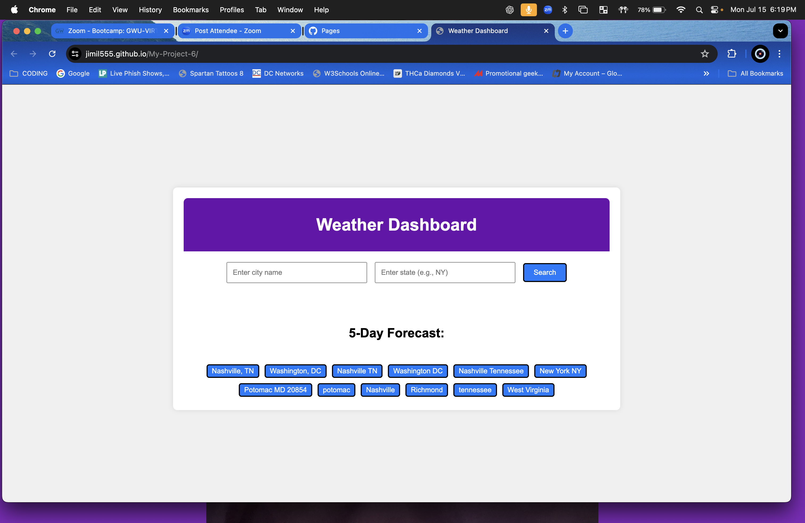

# My-Project-6

# Weather Dashboard

## Description
This is an interactive weather dashboard application that allows users to search for cities and view the current weather conditions and a 5-day forecast. The application is built using the OpenWeather API and styled with Bulma CSS framework.

## Technologies Used
- HTML
- CSS (Bulma)
- JavaScript
- OpenWeather API

## Screenshot

## Links
- [Deployed Application](https://jimil555.github.io/My-Project-6/)
- [GitHub Repository](https://github.com/JimiL555/My-Project-6.git)